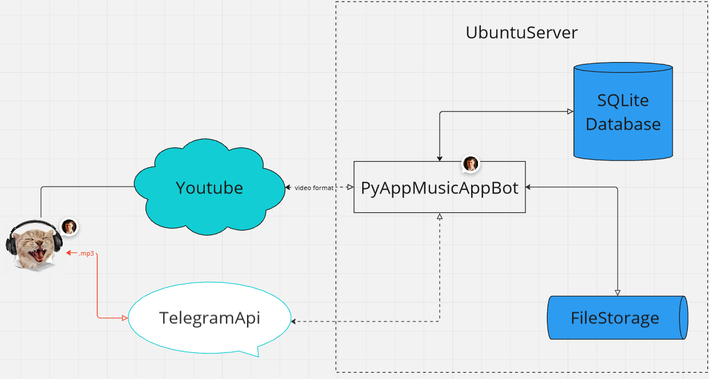

## YouTube Playlist to Telegram Bot
### Project Purpose:

The primary goal of this project is to allow users to update their playlists online once, enabling them to enjoy their tracks offline. This is particularly useful for listening on the road, in areas with poor internet connectivity, or simply for enjoying music without being tethered to an internet connection.
### How It Works:

    1. Creating a Playlist:
        The user creates a playlist on YouTube with any desired name and adds tracks to it.

    2. Linking to Telegram:
        The user opens Telegram and sends the playlist link to the bot once. This link is stored for future reference.

    3. Downloading Tracks:
        The user clicks the "Download" or "Скачать" button in Telegram.
        The bot parses all tracks from the provided YouTube playlist link.
        Video files are converted to .mp3 format.
        Each track is downloaded to a separate folder created for each user.
        The database records each track with a status code of 0 (indicating the track is downloaded but not yet sent).

    - Handling Downloads:
        If the Telegram API is unavailable, the tracks remain in the local storage until the user clicks the "Download" button again.
        Upon the next click, all previously downloaded tracks are sent from local storage to the user via Telegram.

    - Sending Tracks:
        When the Telegram API is available, tracks are automatically sent to the user through the Telegram bot.
        The database status for each track changes to 1, preventing duplicate sends on subsequent downloads.

### Technical Implementation:

    - Asynchronous Interaction:
        Implemented using the asyncio library, allowing multiple users (2-3 or more) to download their playlists simultaneously without interfering with each other. Note: This functionality has not been fully tested.

    - Bot Communication:
        The bot communicates with the Telegram API by polling every 20 seconds.

    - Deployment:
        Designed to be hosted on a server. For development, a Raspberry Pi with Ubuntu was used, demonstrating that the project does not require extensive resources.

    - Database:
        SQLite is used as the database backend. Although SQLite is convenient, it may face inconsistencies, especially with asynchronous operations. For better reliability and performance, migrating to a more robust database like MySQL or PostgreSQL is recommended.

***This project provides a seamless way for music lovers to keep their playlists updated and accessible offline, combining the convenience of YouTube playlists with the accessibility of Telegram bots.***
